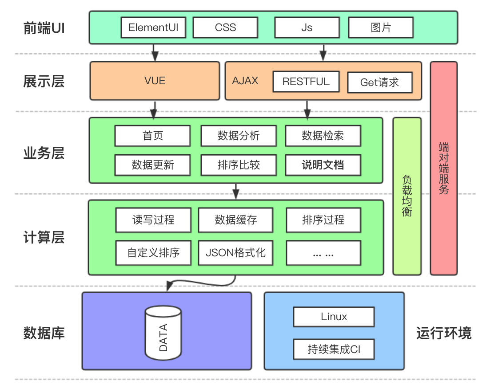
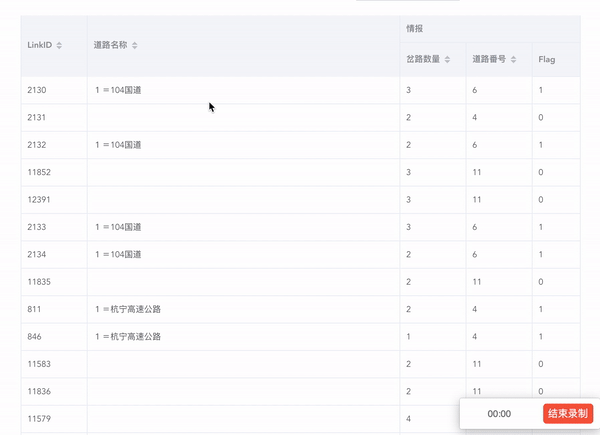
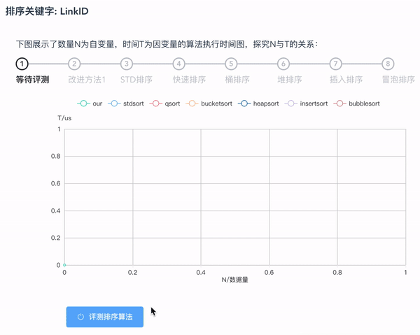

<p align="center">
<!--
  <a href="http://lcui.org/">
    
  </a>-->
  <h3 align="center">Map System</h3>
  <p align="center">
    A full-stack end-to-end road retrieval system.
  </p>
  <p align="center">
    
    <a href="http://opensource.org/licenses/MIT"></a>
    
    
  </p>
</p>

## System Architecture



## Demo

### Road Retrieval



### Algorithm Analysis



## Online Demo

We provide a online demo in a 1core-512Mb virtual machine.
Open http://144.202.78.149:5000/

## Usage

### Docker
```bash
docker build .
docker run -p 5000:5000 <id>
```

#### Open http://127.0.0.1:5000/

### Or You can run on your own

#### Clone Project

```bash
git clone https://github.com/chengsyuan/MapSystem.git
cd MapSystem
```

#### Compiler cpp backend

```bash
cd cpp_backend && cmake CMakeLists && make && cp ./cpp_backend ../backend/
```

#### Run flask (web server)

```bash
cd ../backend && pip install flask && python app.py
```

#### Open http://127.0.0.1:5000/

## About

This software (Map System) is an coursework for "Internship" and the instructor is Jianguang, Wu

```
Author: Chengxuan Ying(@chengsyuan), Ting yi Yu(@paranoiall) and Junwen Huang(inkevin).
Last Update: 11.26.2019
```
